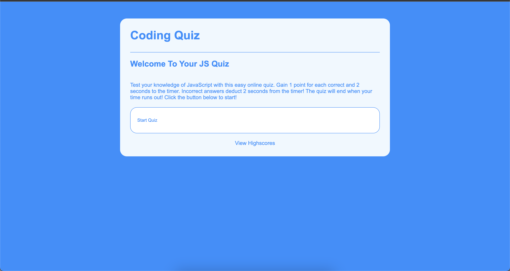

<h1>A quiz to test your Javscript knowledge - built with JavaScript</h1>

---

Please view the deployed application via the link below:
https://mlukicdesign.github.io/ML-CodeQuiz/

----

<h1>Acceptance Criteria</h1>

GIVEN I am taking a code quiz
WHEN I click the start button
THEN a timer starts and I am presented with a question
WHEN I answer a question
THEN I am presented with another question
WHEN I answer a question incorrectly
THEN time is subtracted from the clock
WHEN all questions are answered or the timer reaches 0
THEN the game is over
WHEN the game is over
THEN I can save my initials and score

<h1>Functionality Process</h1>

Question arrays are defined to store the questions for each step. The correct answer is assigned the boolean 'true' while incorrect answers are defined the boolean 'false'. A timer function is defined using the setInterval object. A conditional statement is used to stop the quiz and show the users store where they are. 

The selectAnswer function is utilised the run the basis of the quiz's functionality. The selected answer is targeted, a conditional statement checks if the right answer is selected. The specicified CSS class for a correct answer is applied and the score is increased by 1 increment. Additionally 5 seconds is added to the timer. If incorrect, the corresponding CSS class for incorrect answers is applied and 5 seconds is deducted from the timer. When an answer is selected, all other answer buttons are disabled and the correct answer is shown. The next button is then displayed.  

At the end of the quiz. the showScore function is initiated. The users scored is displayed and the UI elements are updated via DOM manipulation. The users is then prompted to submit their initials and time. This highscore is stored locally via JSON parse within an array. This is then uploaded as a list item on a unoredered list on the corresponding 'highscores' page.

View the comment in the code for step by step process. 